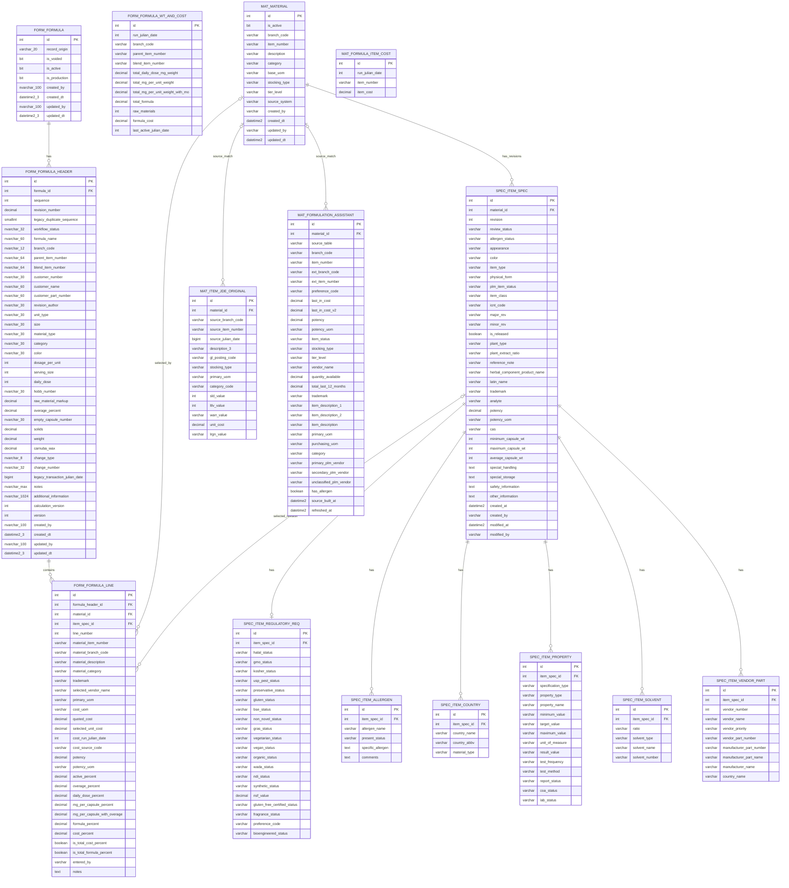

# Proposed PLM ERD

```mermaid
erDiagram
FORM_FORMULA {
    int id PK
    varchar_20 record_origin
    bit is_voided
    bit is_active
    bit is_production
    nvarchar_100 created_by
    datetime2_3 created_dt
    nvarchar_100 updated_by
    datetime2_3 updated_dt
}
FORM_FORMULA_HEADER {
    int id PK
    int formula_id FK
    int sequence
    decimal revision_number
    smallint legacy_duplicate_sequence
    nvarchar_32 workflow_status
    nvarchar_60 formula_name
    nvarchar_12 branch_code
    nvarchar_64 parent_item_number
    nvarchar_64 blend_item_number
    nvarchar_30 customer_number
    nvarchar_60 customer_name
    nvarchar_60 customer_part_number
    nvarchar_30 revision_author
    nvarchar_30 unit_type
    nvarchar_30 size
    nvarchar_30 material_type
    nvarchar_30 category
    nvarchar_30 color
    int dosage_per_unit
    int serving_size
    int daily_dose
    nvarchar_30 hobb_number
    decimal raw_material_markup
    decimal overage_percent
    nvarchar_30 empty_capsule_number
    decimal solids
    decimal weight
    decimal carnuba_wax
    nvarchar_8 change_type
    nvarchar_32 change_number
    bigint legacy_transaction_julian_date
    nvarchar_max notes
    nvarchar_1024 additional_information
    int calculation_version
    int version
    nvarchar_100 created_by
    datetime2_3 created_dt
    nvarchar_100 updated_by
    datetime2_3 updated_dt
}
FORM_FORMULA_LINE {
    int id PK
    int formula_header_id FK
    int material_id FK
    int item_spec_id FK
    int line_number
    varchar material_item_number
    varchar material_branch_code
    varchar material_description
    varchar material_category
    varchar trademark
    varchar selected_vendor_name
    varchar primary_uom
    varchar cost_uom
    decimal quoted_cost
    decimal selected_unit_cost
    int cost_run_julian_date
    varchar cost_source_code
    decimal potency
    varchar potency_uom
    decimal active_percent
    decimal overage_percent
    decimal daily_dose_percent
    decimal mg_per_capsule_percent
    decimal mg_per_capsule_with_overage
    decimal formula_percent
    decimal cost_percent
    boolean is_total_cost_percent
    boolean is_total_formula_percent
    varchar entered_by
    text notes
}
FORM_FORMULA_WT_AND_COST {
    int id PK
    int run_julian_date
    varchar branch_code
    varchar parent_item_number
    varchar blend_item_number
    decimal total_daily_dose_mg_weight
    decimal total_mg_per_unit_weight
    decimal total_mg_per_unit_weight_with_mo
    decimal total_formula
    int raw_materials
    decimal formula_cost
    int last_active_julian_date
}
MAT_MATERIAL {
    int id PK
    bit is_active
    varchar branch_code
    varchar item_number
    varchar description
    varchar category
    varchar base_uom
    varchar stocking_type
    varchar tier_level
    varchar source_system
    varchar created_by
    datetime2 created_dt
    varchar updated_by
    datetime2 updated_dt
}
MAT_FORMULA_ITEM_COST {
    int id PK
    int run_julian_date
    varchar item_number
    decimal item_cost
}
SPEC_ITEM_SPEC {
    int id PK
    int material_id FK
    int revision
    varchar review_status
    varchar allergen_status
    varchar appearance
    varchar color
    varchar item_type
    varchar physical_form
    varchar plm_item_status
    varchar item_class
    varchar icnt_code
    varchar major_rev
    varchar minor_rev
    boolean is_released
    varchar plant_type
    varchar plant_extract_ratio
    varchar reference_note
    varchar herbal_component_product_name
    varchar latin_name
    varchar trademark
    varchar analyte
    decimal potency
    varchar potency_uom
    varchar cas
    int minimum_capsule_wt
    int maximum_capsule_wt
    int average_capsule_wt
    text special_handling
    text special_storage
    text safety_information
    text other_information
    datetime2 created_at
    varchar created_by
    datetime2 modified_at
    varchar modified_by
}
SPEC_ITEM_REGULATORY_REQ {
    int id PK
    int item_spec_id FK
    varchar halal_status
    varchar gmo_status
    varchar kosher_status
    varchar usp_pest_status
    varchar preservative_status
    varchar gluten_status
    varchar bse_status
    varchar non_novel_status
    varchar gras_status
    varchar vegetarian_status
    varchar vegan_status
    varchar organic_status
    varchar wada_status
    varchar ndi_status
    varchar synthetic_status
    decimal nsf_value
    varchar gluten_free_certified_status
    varchar fragrance_status
    varchar preference_code
    varchar bioengineered_status
}
SPEC_ITEM_ALLERGEN {
    int id PK
    int item_spec_id FK
    varchar allergen_name
    varchar present_status
    text specific_allergen
    text comments
}
SPEC_ITEM_COUNTRY {
    int id PK
    int item_spec_id FK
    varchar country_name
    varchar country_abbv
    varchar material_type
}
SPEC_ITEM_PROPERTY {
    int id PK
    int item_spec_id FK
    varchar specification_type
    varchar property_type
    varchar property_name
    varchar minimum_value
    varchar target_value
    varchar maximum_value
    varchar unit_of_measure
    varchar result_value
    varchar test_frequency
    varchar test_method
    varchar report_status
    varchar coa_status
    varchar lab_status
}
SPEC_ITEM_SOLVENT {
    int id PK
    int item_spec_id FK
    varchar ratio
    varchar solvent_type
    varchar solvent_name
    varchar solvent_number
}
SPEC_ITEM_VENDOR_PART {
    int id PK
    int item_spec_id FK
    int vendor_number
    varchar vendor_name
    varchar vendor_priority
    varchar vendor_part_number
    varchar manufacturer_part_number
    varchar manufacturer_part_name
    varchar manufacturer_name
    varchar country_name
}
MAT_ITEM_JDE_ORIGINAL {
    int id PK
    int material_id FK
    varchar source_branch_code
    varchar source_item_number
    bigint source_julian_date
    varchar description_3
    varchar gl_posting_code
    varchar stocking_type
    varchar primary_uom
    varchar category_code
    int sld_value
    int ltlv_value
    varchar warr_value
    decimal unit_cost
    varchar lrgn_value
}
MAT_FORMULATION_ASSISTANT {
    int id PK
    int material_id FK
    varchar source_table
    varchar branch_code
    varchar item_number
    varchar ext_branch_code
    varchar ext_item_number
    varchar preference_code
    decimal last_in_cost
    decimal last_in_cost_v2
    decimal potency
    varchar potency_uom
    varchar item_status
    varchar stocking_type
    varchar tier_level
    varchar vendor_name
    decimal quantity_available
    decimal total_last_12_months
    varchar trademark
    varchar item_description_1
    varchar item_description_2
    varchar item_description
    varchar primary_uom
    varchar purchasing_uom
    varchar category
    varchar primary_plm_vendor
    varchar secondary_plm_vendor
    varchar unclassified_plm_vendor
    boolean has_allergen
    datetime2 source_built_at
    datetime2 refreshed_at
}
FORM_FORMULA ||--o{ FORM_FORMULA_HEADER : has
FORM_FORMULA_HEADER ||--o{ FORM_FORMULA_LINE : contains
MAT_MATERIAL ||--o{ SPEC_ITEM_SPEC : has_revisions
SPEC_ITEM_SPEC ||--o| SPEC_ITEM_REGULATORY_REQ : has
SPEC_ITEM_SPEC ||--o{ SPEC_ITEM_ALLERGEN : has
SPEC_ITEM_SPEC ||--o{ SPEC_ITEM_COUNTRY : has
SPEC_ITEM_SPEC ||--o{ SPEC_ITEM_PROPERTY : has
SPEC_ITEM_SPEC ||--o{ SPEC_ITEM_SOLVENT : has
SPEC_ITEM_SPEC ||--o{ SPEC_ITEM_VENDOR_PART : has
MAT_MATERIAL o|--o{ MAT_ITEM_JDE_ORIGINAL : source_match
MAT_MATERIAL o|--o{ MAT_FORMULATION_ASSISTANT : source_match
MAT_MATERIAL o|--o{ FORM_FORMULA_LINE : selected_by
SPEC_ITEM_SPEC o|--o{ FORM_FORMULA_LINE : selected_revision
```
